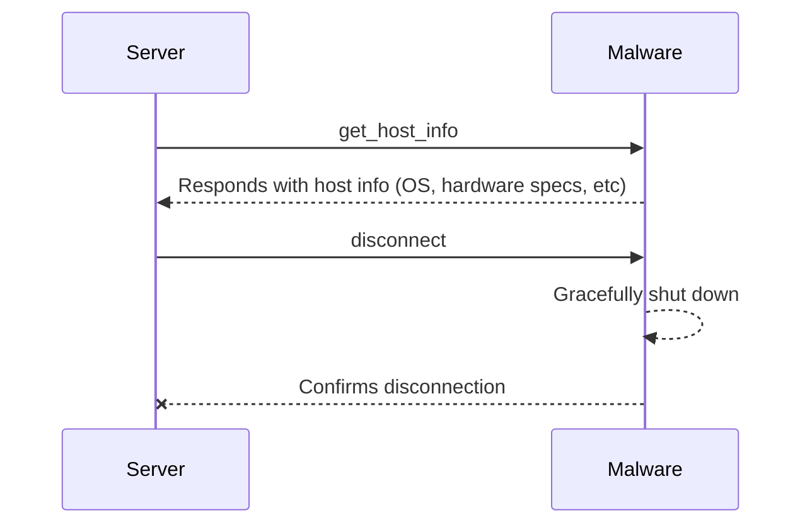
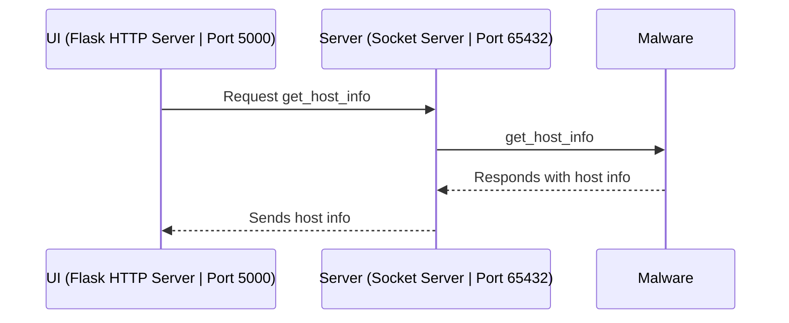
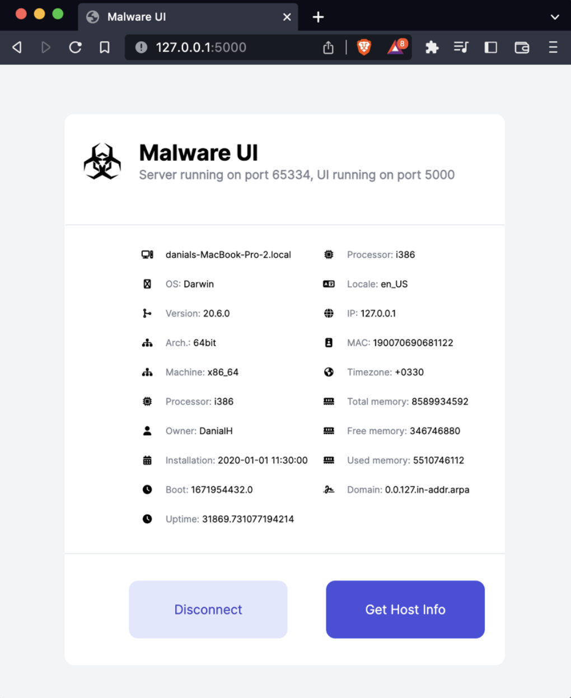

This repository contains some simple practical projects I completed as part of my Information Security course at Amirkabir University of Technology in Fall 2022. For each assignment, there is an `instructions.pdf` and `report.pdf` explaining the exercise in detail (in Persian). 

### Projects

#### IP Scanner
This assignment has two parts. First, three command-line tools are developed:

- Ping - Uses `sockets` library to mimic the ping command. 
- Host Scanner - Scans a range of IPs to find active hosts.
- Port Scanner - Scans ports of a host to identify status.

Second, tools like `nmap`, `netdiscover`, and `hping3` are used to verify the functionality of our implementations. The report also explains the behaviour of various nmap scan options.

#### AES Encryptor/Decryptor
This tool encrypts/decrypts a file using AES in CTR mode. The initial key is read from `data/key.txt` (a salt is added). 

#### PoC Malware  
This project aims to develop a basic proof-of-concept malware to understand security vulnerabilities in systems. 
The implemented PoC malware gathers information about the infected host, and sends the results to a server as JSON through a TCP connection using Python's `sockets` library.
The server, also written in Python using sockets, listens for new connections and communicates with the malware using two commands:
- `get_host_info`: instructs the malware to gather the information and send them back.
- `disconnect`: instructs the malware to gracefully shut down.

A graphical user interface is also developed using `Flask`. This `UI` component runs as a web server, allowing the user to send commands and view results through a browser.

Here's a glance of the UI.

## Course Information
- **Course**: Information Security
- **University**: Amirkabir University of Technology  
- **Semester**: Fall 2022

Let me know if you have any questions!

